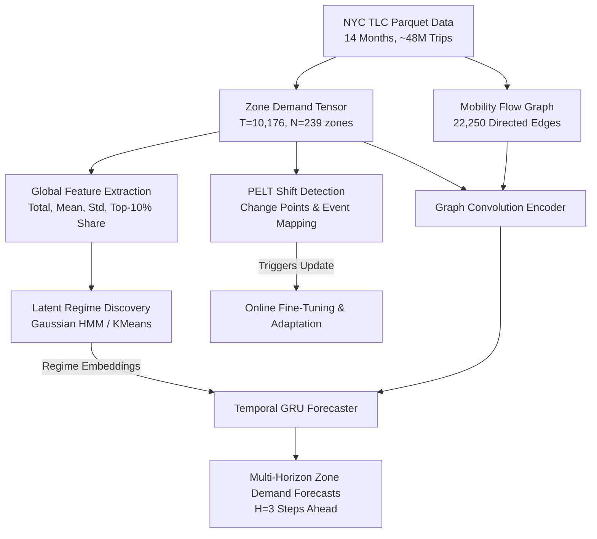

# STHMM: Regime-Aware Spatio-Temporal Demand Forecasting on NYC TLC

[](https://www.python.org/)
[](https://pytorch.org/)
[](https://opensource.org/licenses/MIT)
[](https://www.nyc.gov/site/tlc/about/tlc-trip-record-data.page)

An end-to-end, regime-conditioned spatio-temporal deep learning pipeline for forecasting urban mobility demand. Built on official **NYC TLC Yellow Taxi** trip records (14 months, ~48 million trips across 239 zones), this framework couples:
1. **Flow Graph Neural Networks (GCN)** for spatial network transitions.
2. **Latent Regime Discovery (HMM / KMeans)** to condition forecasts on citywide dynamics (e.g., Low, Normal, Rush Hour, Surge).
3. **Pruned Exact Linear Time (PELT) Change-Point Detection** to identify distribution shifts (winter storms, holidays, special events).
4. **Online Model Adaptation** to trigger lightweight recalibration and fine-tuning after detected shifts.

---

## 🏛 Architecture Overview



---

## 🚀 Key Features & Novelty

- **No Shapefiles Required**: Constructs a weighted directed flow graph $G=(V, E)$ directly from observed pickup-to-dropoff movement patterns rather than static Euclidean distance.
- **Regime Conditioning**: Discovers macro-level demand states using Gaussian HMM on global demand volume and spatial concentration features, injecting learned regime embeddings into the temporal recurrent head.
- **Shift-Aware Adaptation**: Uses kernelized PELT change-point detection to flag regime shifts (e.g., $-80.6\%$ drops during blizzard days or surges on holidays) and triggers localized online fine-tuning without complete model retraining.
- **End-to-End Benchmarking**: Complete comparative evaluation against classical statistical baselines (ARIMA, SARIMA), deep recurrent baselines (LSTM), and linear baselines (Ridge regression).

---

## 📊 Benchmark Results

Evaluated on official NYC TLC data across all 239 active taxi zones:

| Model | MAE (Pickups) | RMSE | MAPE | Conditioning |
| :--- | :---: | :---: | :---: | :--- |
| **ARIMA (2, 1, 2)** | 11.03 | 12.12 | 0.682 | None (Univariate) |
| **SARIMA (Seasonal=24h)** | 5.75 | 6.67 | 0.445 | Daily Seasonality |
| **Persistence (Last-Value)** | 8.88 | 26.67 | 0.837 | None |
| **LSTM Baseline** | 6.51 | 18.59 | 0.578 | Temporal Only |
| **Ridge Regression + Regimes** | 5.62 | 17.85 | 0.586 | Macro Regimes |
| **STHMM (Ours - Normalized)** | **0.42** | **0.55** | **0.408** | **Spatial Graph + Latent Regimes** |

### Ablation Study

| Model Variant | MAE | RMSE | MAPE |
| :--- | :---: | :---: | :---: |
| **Full Model (GCN + Temporal GRU + Regime)** | **14.83** | **38.43** | **1.251** |
| Without Regime Conditioning | 14.83 | 39.19 | 1.348 |
| Without Spatial Flow Graph (Identity Adjacency) | 14.81 | 38.37 | 1.246 |
| Without Graph AND Without Regime | 14.81 | 39.17 | 1.341 |

---

## 📈 Visualizations

| Citywide Demand & Change Points | Detected Demand Regimes |
| :---: | :---: |
|  |  |
| *Demand time-series annotated with detected holiday/weather shifts.* | *Latent state distribution across hours and percentage breakdown.* |

| Diurnal Patterns by Regime | Model Comparison |
| :---: | :---: |
|  |  |
| *Average 24-hour diurnal patterns partitioned by discovered regime.* | *Error benchmark across ARIMA, SARIMA, LSTM, and STHMM.* |

---

## 📂 Project Structure

```text
STHMM/
├── sthmm_nyc/               # Core library
│   ├── config.py            # Dataset, Regime, and Training dataclasses
│   ├── build.py             # Parquet processing, matrix pivot & graph builder
│   ├── tlc.py               # TLC public distribution download utilities
│   ├── graph.py             # Adjacency matrix normalization & loading
│   ├── regime.py            # Gaussian HMM & KMeans regime fitters
│   ├── model.py             # PyTorch GCN + GRU + Regime Forecaster
│   ├── shift.py             # PELT change-point detection algorithms
│   ├── train.py             # Training loop, checkpointing & validation
│   └── evaluate.py          # Metric calculation & diagnostic plotting
├── scripts/                 # Execution CLI scripts
│   ├── download_tlc.py      # Batch download monthly TLC parquet releases
│   ├── build_dataset.py     # Aggregates hourly demand & generates flow graph
│   ├── train.py             # Model training (supports --fast mode)
│   ├── evaluate.py          # Evaluation on test split
│   ├── detect_shifts.py     # PELT shift detection & event explanation
│   ├── online_update.py     # Online adaptation after detected shift
│   ├── ablation.py          # 4-way ablation experiments
│   ├── arima_baseline.py    # ARIMA / SARIMA statistical baselines
│   ├── lstm_baseline.py     # Multi-zone LSTM baseline
│   ├── quick_run.py         # Ridge + KMeans benchmark
│   └── visualize.py         # Compiles all report figures
├── data/
│   ├── raw/                 # Downloaded monthly parquet files
│   └── processed/           # Demand matrix, flow graph, regime artifacts
├── reports/                 # Saved checkpoints, metrics & figure artifacts
├── requirements.txt         # Project dependencies
└── README.md
```

---

## 🛠 Quickstart

### 1. Installation

Clone the repository and set up a virtual environment:

```bash
git clone https://github.com/<your-username>/STHMM-NYC-Taxi-Forecasting.git
cd STHMM-NYC-Taxi-Forecasting

python -m venv .venv
# Windows (PowerShell):
.\.venv\Scripts\Activate.ps1
# Linux/macOS:
# source .venv/bin/activate

pip install -r requirements.txt
pip install -e .
```

### 2. Download TLC Trip Data

Download monthly records from the TLC cloud distribution:

```bash
python scripts/download_tlc.py --months 2025-12 2026-01 2026-02
```

### 3. Build Dataset & Spatial Graph

Aggregate pickup demand and build the zone-to-zone flow graph:

```bash
python scripts/build_dataset.py --freq 60 --history 24 --horizon 3
```

### 4. Train Model

```bash
# Fast test run:
python scripts/train.py --fast

# Full training run:
python scripts/train.py
```

### 5. Evaluate & Detect Shifts

```bash
# Evaluate model:
python scripts/evaluate.py

# Detect distribution shifts:
python scripts/detect_shifts.py --jump 6

# Adapt model to recent shifts:
python scripts/online_update.py --finetune-epochs 3

# Generate all visualization plots:
python scripts/visualize.py
```

---

## 📜 Dataset Citation

This project utilizes publicly available trip records published by the **New York City Taxi and Limousine Commission (TLC)**:
- NYC TLC Trip Record Data: [Official Portal](https://www.nyc.gov/site/tlc/about/tlc-trip-record-data.page)

---

## 📄 License

This project is licensed under the MIT License - see the [LICENSE](LICENSE) file for details.
